# Data-flow architecture: data-store, UI updates, vehicle telemetry & map

How a daemon publishes/subscribes a data-point, how a change reaches the UI, how
vehicle telemetry is stored, and how a vehicle is tracked on the map — with the
real component, method, and message names from the code.

> **Live vs designed.** The telemetry map + 60-day history ride **`lwm2m-dm`
> server-Reads** of LwM2M Objects 6 & 33000 today. The LwM2M **Send/SenML** path
> is coded + unit-tested but its session-I/O glue and server persist are **gated
> off / stubbed** — it is *not* on the live path. Divergences are called out.

---

## 0. Components at a glance

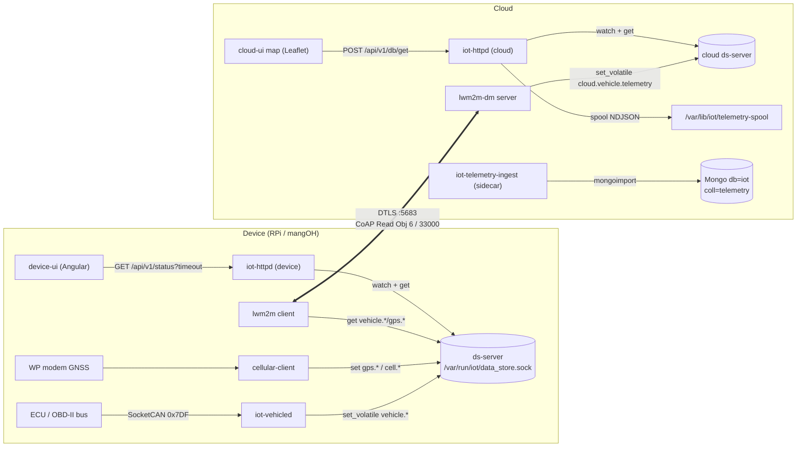

---

## 1. App ⇄ data-store: publish & subscribe a data-point

The data-store (**ds**) is a typed key/value plane. Daemons talk to `ds-server`
over a unix socket (`/var/run/iot/data_store.sock`) using the **EMP** wire
protocol (`modules/data-store/inc/data_store/proto.hpp`): an 8-byte big-endian
header `{cmdID, type, reqID, size}` + JSON body.

Ops (`proto::Op`): `Set 0x0001`, `Get 0x0002`, `RegisterWatch 0x0003`,
`RemoveWatch 0x0004`, `NotifyEvent 0x0064` (server→client **push**).

Keys are typed by `*.lua` **schema** files loaded from `/etc/iot/ds-schemas/`
(`type`, `access`, `default`, `min`/`max`, `read_acl`/`write_acl`). A `Set` is
validated against the schema (`Status::SchemaRejected` on mismatch). **Persistent**
keys write `m_data` and flush to `/var/lib/iot/data_store.lua`; **volatile** keys
(`set_volatile`) write an in-RAM overlay only — used for fast-changing telemetry —
and are lost on server restart. Both emit identical `NotifyEvent` pushes.

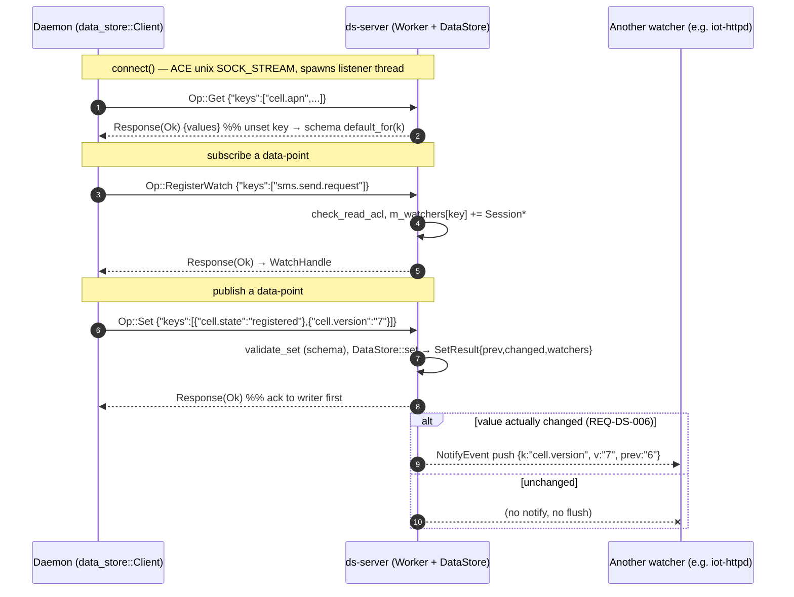

**Concrete example — `cellular-client`** (`modules/wan/cellular/daemon/cellular_client.cpp`):

1. `m_ds.connect(...)` → 2. `load_config_from_ds()` issues `get` for
`cell.apn`/`cell.modem.tty`/… (Admin read keys) → 3.
`watch("sms.send.request", on_send_request, &wh)` → 4. every poll
`publish()` builds `m_state.to_kv()` and `set(...)` the Viewer status keys
(`cell.state/operator/signal.dbm/ip/…`) plus the **bump counter `cell.version`**.
`sms.send.status` progress uses `set_volatile`.

> The **`*.version` bump keys** are the trick that makes the UI cheap: the daemon
> increments `cell.version` only when something actually changed, and that single
> key is what the `/status` long-poll watches.

---

## 2. How an update reaches the UI (long-poll round trip)

`iot-httpd` serves `GET /api/v1/status?timeout=N` (`modules/http-server/src/handler.cpp`).
It registers ds watches on a small set of **bump/edge keys** — `cell.version`,
`gps.version`, `sms.version`, `vpn.state`, `iot.conn.state`,
`services.stats.version`, `log.version`, `iot.update.state`, `cloud.update.status`,
`iot.sensor.version` — then blocks on a condition variable up to `timeout`
seconds. A `NotifyEvent` on any of them wakes it; it then does one bulk `get` of
~180 keys, builds a nested JSON snapshot (`lwm2m/vpn/wifi/wan/cell/gps/sensor/…`),
and returns it — ending the long-poll. On timeout it returns the snapshot anyway.

The Angular `DataStoreService` keeps a permanent long-poll open and republishes
each snapshot to a `BehaviorSubject`; components `observeStatus().subscribe(...)`.

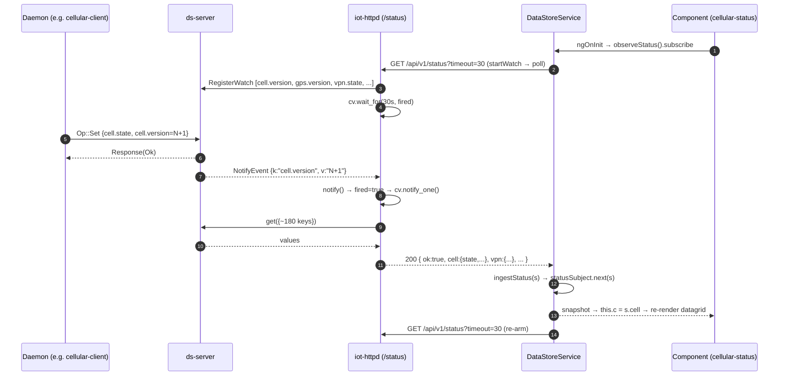

**Config writes** go the other way: the UI calls `ds.write([{key,value}...])` →
`POST /api/v1/db/set` → `ds-server Op::Set`. Example: the Send-SMS box writes
`sms.send.to` + `sms.send.text` + bumps `sms.send.request`, which the daemon's
watch (step 3 above) is waiting on.

---

## 3. Vehicle telemetry: ingest → storage

**Ingest.** `iot-vehicled` (`modules/vehicle/`) opens a raw SocketCAN socket on
`can0`, round-robins Mode 01 PID requests on the functional id `0x7DF`, decodes
ECU replies (`0x7E8..0x7EF`) with the pure `obd_pid` core, and publishes each
signal **volatile** to `vehicle.*`. DTCs (Mode 03, single-frame only) go to the
**persistent** `vehicle.dtc`. GPS position comes separately from `cellular-client`
(`gps.lat/lon`).

**Storage is two-tier, and the live path is server-Reads — not Send:**

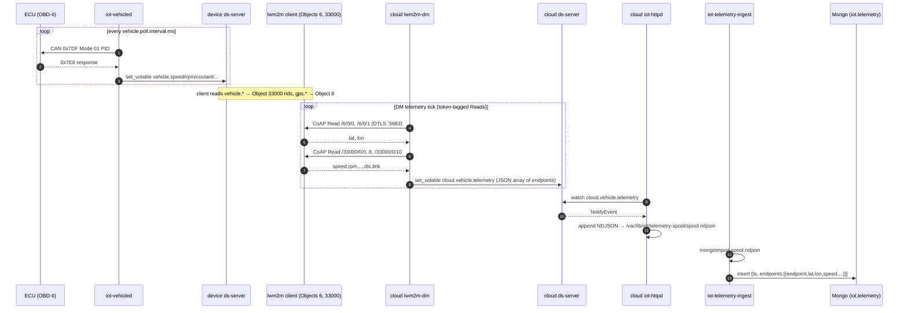

### Device-side store-and-forward buffer (the v2 Send path — **gated off**)

The on-device Mongo buffer in the original TDD was **rejected** in favour of a
SQLite outbox, **`DurableSampleBuffer`** (`apps/inc/lwm2m_durable_sample_buffer.hpp`),
which the LwM2M-Send `Uploader` drains. It exists and is unit-tested but is
**off by default** (`iot.telemetry.send.enable=false`) and the **cloud persist for
a Send report is a stub** (`onSendReport` just logs), so nothing is stored via
Send today.

```
outbox( seq  INTEGER PRIMARY KEY AUTOINCREMENT,
        ts   INTEGER,              -- llround(timeUnix * 1000)
        body BLOB,                 -- Sample as compact JSON {t, v:[[name,val]...]}
        sent INTEGER DEFAULT 0 )   -- 0=queued, 1=leased; WAL, synchronous=NORMAL
```

Semantics: `push`→INSERT (+evict over cap); `take(n)`→**lease** oldest n
(`sent=1`, not deleted); `commit()`→DELETE on 2.04 ACK; `requeue()`→un-lease on
timeout; `reap_expired()`→TTL delete. On open, leased rows re-arm to `sent=0` →
**at-least-once** (cloud dedups by `(endpoint, seq)`).

### Cloud collection

Db `iot`, collection **`telemetry`** (`mongo:5.0`, opt-in `telemetry` compose
profile). One document per poll cycle:

```json
{ "ts": 1783726848,
  "endpoints": [
    { "endpoint":"000000006556e041", "lat":12.97,"lon":77.59,
      "speed":42,"rpm":1800,"coolant":88,"throttle":18,"load":34,
      "fuel":61,"iat":31,"maf":12.4,"link":"up","dtc":"" } ] }
```

> **Divergences from the TDD:** the cloud collection is a **plain** collection via
> `mongoimport` — *not* a native time-series with `expireAfterSeconds`; retention
> is a separate `iot-archiver` script (dump → verify → prune). ISO-TP multi-frame
> DTCs (`obd/isotp.cpp`) are **not** implemented (single-frame only). `iot-mqttd`
> has **no** source/unit in-tree and is not on the telemetry path.

---

## 4. How a vehicle is tracked on the map

Position originates from the modem GNSS, is exposed as **LwM2M Object 6
(Location)**, server-Read by `lwm2m-dm`, merged into `cloud.vehicle.telemetry`
alongside the Object-33000 signals, and plotted by the cloud-UI **Leaflet** map.

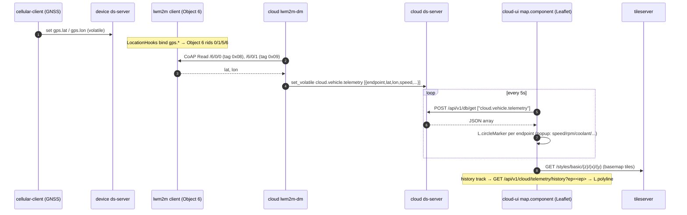

- **Live markers:** `map.component.ts` long-polls `cloud.vehicle.telemetry` every
  5 s and draws a `L.circleMarker` per endpoint with a fix.
- **History track:** `GET /api/v1/cloud/telemetry/history?ep=<ep>` →
  `L.polyline` (served from `history.json` produced by the ingest sidecar's
  `mongoexport`).
- **Endpoints → Map:** the Endpoints datagrid links to the map via a `?ep=`
  focus param. Note `cloud.endpoints` rows do **not** carry lat/lon (that TDD idea
  was not implemented); position lives only in `cloud.vehicle.telemetry`.

---

## 5. Device-UI access over the VPN (path-scoped reverse proxy)

The operator opens a device's **own web UI** from the cloud Endpoints page
("Launch UI"). The live mechanism is a **same-origin path-scoped reverse proxy**
(`modules/http-server/src/handler_proxy.cpp`, design:
`apps/docs/tdd-device-ui-path-proxy.md`): the cloud `iot-httpd` serves
`/dev/<endpoint>/…` and forwards each request over the OpenVPN tun to the
device's `iot-httpd`. It replaced the per-device published-port + nftables DNAT
approach (`iot-cloudd` still installs the `ip iot_cloud_dnat` DNAT table —
`cloud:<proxy_port> → dev_tun_ip:<ui_port>` — as the direct-port route, shown in
the Endpoints row expander).

Three rewrites make the device SPA (built with `base href "/"`, relative asset
URLs) work under the prefix with **no per-device rebuild**: request-path strip,
`base href` inject, and `Set-Cookie Path` scoping (per-device cookie isolation).
`iot-httpd` shares `iot-cloudd`'s network namespace so `tun0` routes are visible
to its upstream connect.

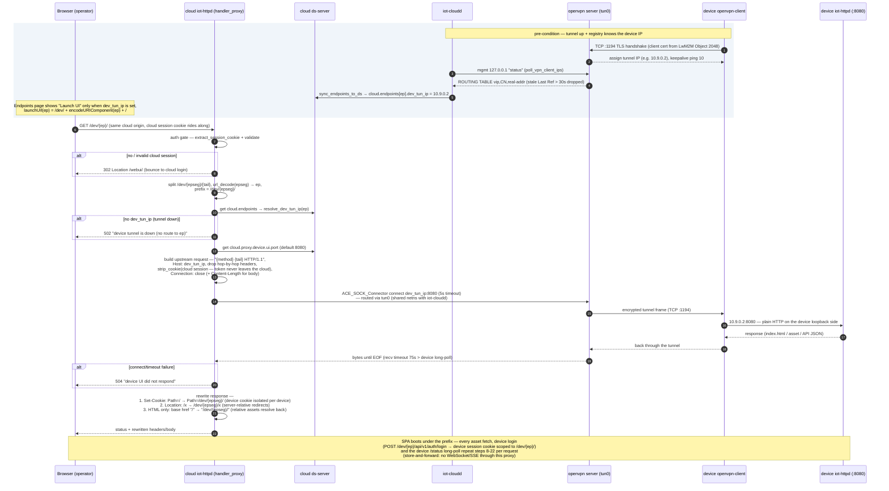

Minute details worth knowing:

- **SSRF-safe by construction:** the upstream target is only ever a
  `dev_tun_ip` looked up from `cloud.endpoints` (written by `iot-cloudd` from
  the OpenVPN management plane) on a fixed port — the URL path cannot steer the
  proxy to an arbitrary host.
- **Two cookie jars, cleanly separated:** the operator's **cloud** session
  cookie is validated at the gate and then **stripped** before forwarding
  (`strip_cookie`), so it never reaches the device; the **device's** session
  cookie comes back with `Path=/dev/<epseg>/`, so N devices can be logged in
  simultaneously from one browser without collisions.
- **Reachability = tunnel, not registration:** Launch UI follows `dev_tun_ip`
  only. The proxy works while the tunnel is up even if the device's LwM2M
  registration has lapsed (registration is shown separately in the State
  column).
- **Store-and-forward:** `upstream_exchange` buffers the full upstream response
  until EOF (`Connection: close` per request). That is why the device-ui
  **Terminal** feature runs on long-poll — WebSocket/SSE cannot pass this
  proxy.
- The `75 s` upstream recv timeout is deliberately longer than the device's
  `/api/v1/status?timeout=30` long-poll, so a held poll completes through the
  proxy instead of 504ing.

---

## 6. VPN plane: certificate delivery + tunnel bring-up (server ⇄ client)

Two flows, in order. **First** the cloud mints and delivers the cert family
(CA cert + client cert + client key) to the device over LwM2M **Object 2048** —
the device generates nothing. **Then** the device's `openvpn-client` dials the
cloud's OpenVPN server, and the server hands it the tunnel network config
(IP, netmask, gateway, DNS, keepalive) in the TLS-protected **PUSH_REPLY**,
which the `openvpn` process itself installs on `tun0`.

### 6.1 PKI: how the CA cert, client cert and private key reach the device

Minting: `CertAuthority` (`modules/server/openvpn/cert_authority.cpp`) runs
entirely on `iot-cloudd` — `ensure()` creates/restores the CA
(`/etc/iot/vpn/ca/ca.key` never leaves the cloud), `mint_client(cn)` runs
`openssl genrsa → req (CSR) → ca` (CA-sign, 10 y) with `cn =
rpi{serial}@cloud.local`. Delivery: `apps/src/lwm2m_dm_server.cpp
build_cert_push` + the chunk codec `apps/inc/lwm2m_cert_chunk.hpp`; install:
`apps/src/lwm2m_object_cert.cpp`.

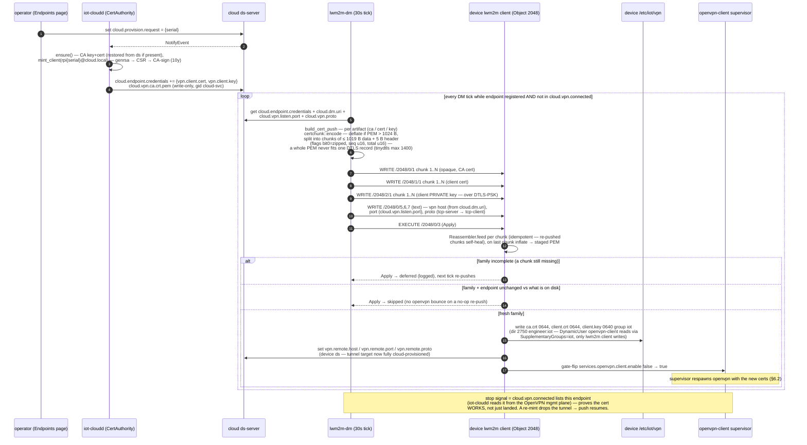

> **Security shape:** the client private key is cloud-generated and exists in
> three places — cloud ds (write-only ACL), the DTLS-PSK-encrypted LwM2M wire,
> and device disk (`0640` group `iot`). The CA **key** is cloud-only; devices
> only ever receive the CA **cert**. Revocation = `openssl ca -revoke` → CRL →
> `cloud.vpn.crl.pem`, enforced by the server's `crl-verify`.

### 6.2 Tunnel bring-up: what the server sends and how tun0 gets configured

Server config (`modules/server/openvpn/openvpn_server.cpp
build_server_config`): `mode server`, `tls-server`, `topology subnet`,
`server 10.9.0.0 255.255.255.0` (the ifconfig-pool), optional per-client
`client-config-dir` (`ifconfig-push` static IPs, multi-tenant), `push
"dhcp-option DNS …"`, `crl-verify`, `dh none` (ECDH), `keepalive 10 60`,
`management 127.0.0.1 {mgmt_port}`. Client config
(`modules/openvpn/client/src/process.cpp build_openvpn_config`): `client`,
`dev tun0`, `proto tcp-client`, `remote {host} {port}`, `nobind`,
`resolv-retry infinite`, `persist-tun`, `persist-key`, `ca/cert/key
/etc/iot/vpn/*`, `management 127.0.0.1 {port}`, **`management-hold`**.

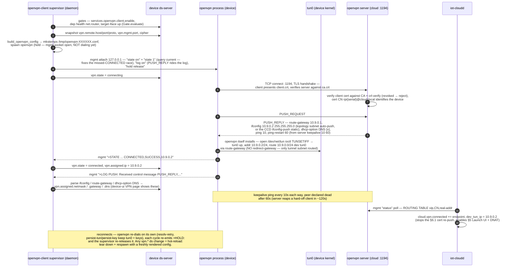

Minute details worth knowing:

- **State names on the wire → `vpn.state`:** the mgmt `>STATE:` codes are
  normalised (`Lifecycle::normalise_state`) — `CONNECTING/TCP_CONNECT →
  connecting`, `RESOLVE → resolving`, `WAIT/GET_CONFIG → wait`, `AUTH → auth`,
  `ASSIGN_IP/ADD_ROUTES → connecting`, `CONNECTED → connected`, `EXITING →
  exited`.
- **Why `management-hold` + `state 1`:** openvpn is spawned *held* so the
  supervisor can attach and enable notifications **before** the first dial —
  otherwise the CONNECTED transition and PUSH_REPLY fire before anyone is
  subscribed and `vpn.state` stalls at "connecting" forever (a real field bug).
  `state 1` additionally queries the *current* state on (re)attach.
- **PUSH_REPLY arrives via the log**, not a mgmt `>PUSH_REPLY` event (most
  openvpn builds don't emit one) — hence `log on` and the
  `PUSH: Received control message` parse.
- **The assigned IP has two sources:** field 4 of the `CONNECTED` state line
  and the `ifconfig` push option — both feed `vpn.assigned.ip`.
- **No default-route hijack:** nothing pushes `redirect-gateway`, so only
  `10.9.0.0/24` rides the tunnel. LwM2M/DTLS (`:5683`) and the OTA download
  stay on the WAN — the VPN is for operator access (device-UI proxy, DNAT),
  not the telemetry plane.
- **LwM2M reacts to the tunnel:** the lwm2m client watches `vpn.state` and
  re-Registers on a reconnect — fast recovery after a cloud restart.

---

## 7. LwM2M plane: bootstrap & DM registration

The control plane is **direct device→cloud DTLS over UDP** (no VPN): bootstrap
on `:5684`, device management on `:5683`. The device is flashed with only its
serial + BS PSK; everything else — the DM account (URI, identity, key),
registration lifetime, binding — is **delivered by the Bootstrap Server** and
committed atomically. Code: client `apps/src/lwm2m_bootstrap_client.cpp` +
`lwm2m_registration_client.cpp`, server `apps/src/lwm2m_bootstrap_server.cpp` +
`lwm2m_registration_server.cpp` (run in `role=server` as the `lwm2m-bs` /
`lwm2m-dm` containers), account synthesis `modules/server/lwm2m/` +
`cloud_credentials.cpp`.

### 7.1 Bootstrap (`/bs`): from factory identity to a DM account

Identities are **derived, never stored**: the BS DTLS identity is
`sha256(serial)[:32]` (computed identically on both ends), the DM identity is
`rpi{serial}@cloud.local` (formatted by the cloud). The device ships with just
`iot.serial` (auto-filled on RPi) + `iot.bs.psk.key` (commissioned via
device-ui, or flash-time HKDF-personalised — zero-touch tier).

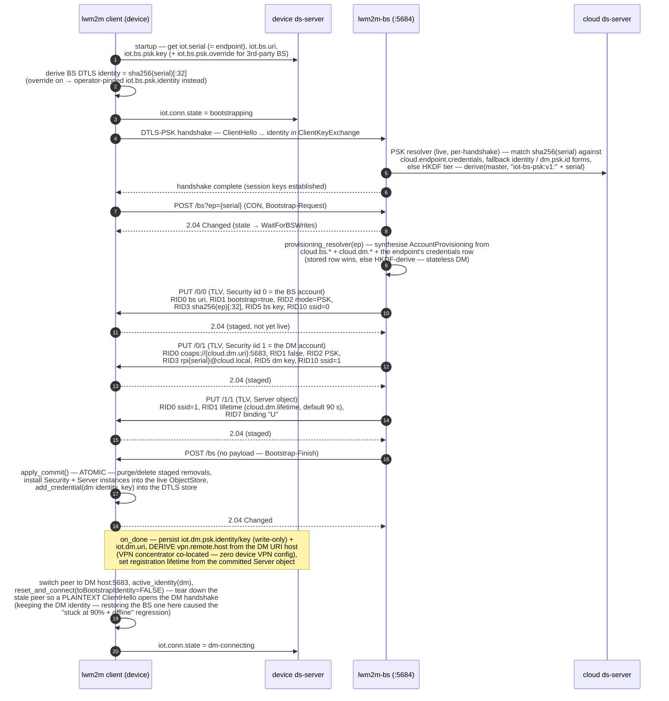

### 7.2 DM registration (`/rd`): register, heartbeat, recover

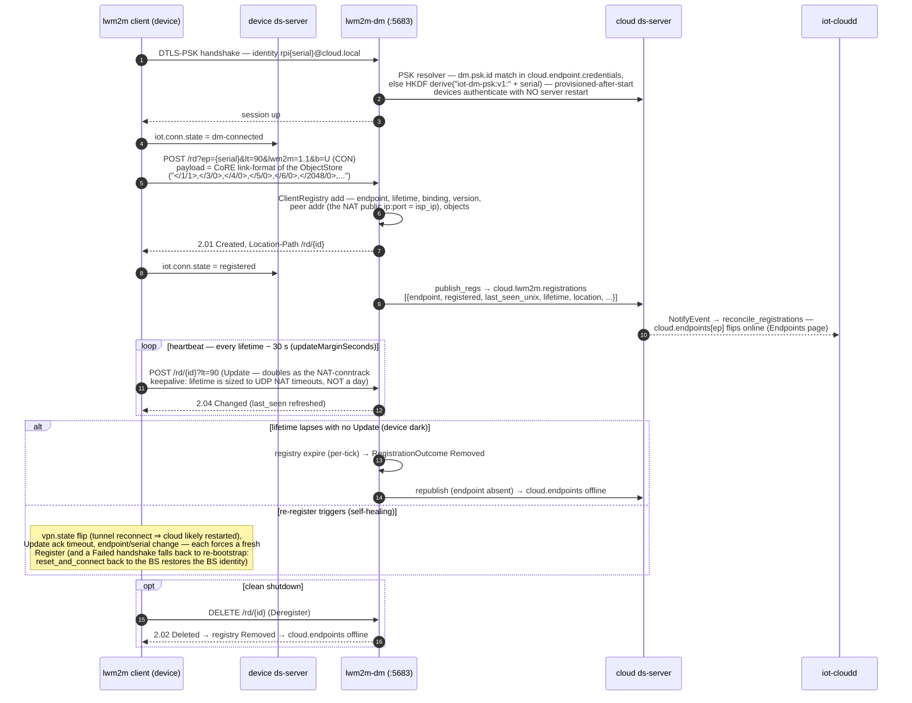

Minute details worth knowing:

- **`iot.conn.state` machine** (`compute_conn_state`, published on change each
  tick): `bootstrapping → bootstrapped → dm-connecting → dm-connected →
  registered`, plus `failed` / `idle`. "-connecting" = DTLS handshake in
  flight, "-connected" = channel up, protocol exchange underway. The device-ui
  and cloud dashboard read exactly this key.
- **Staging is all-or-nothing:** Bootstrap-Writes land in a `StagingBuffer`
  (the live store is untouched); only Bootstrap-Finish `apply_commit()`s —
  a half-delivered bootstrap can't leave a device with a broken mix.
- **Bootstrap-Delete** (`DELETE /` purge or `DELETE /{oid}/{iid}`) is honored
  in staging too — the BS wipes stale accounts before writing fresh ones.
- **Lifetime 90 s is deliberate:** the Update at `lifetime − 30 s` (fixed
  `updateMarginSeconds`) keeps the home-router UDP conntrack mapping alive
  (assured-UDP timeout ≈ 120 s) so the cloud can still reach the device for
  OTA pushes and server-Reads. See the NAT-keepalive table in
  `apps/cloud/CLAUDE.md`.
- **The DM peer address is the device's public IP** — `ClientRegistry`
  captures the Register's DTLS source (`isp_ip` in the Endpoints table),
  VPN-independent.
- **Two hard-won wedge fixes live in this path:** (1) on the DM switch,
  `reset_and_connect` must keep the **DM** identity (`toBootstrapIdentity=
  false`) — restoring the BS identity left devices unregistered after OTA;
  (2) a cloud restart leaves the device's tinydtls peer CONNECTED while the
  server forgot it — the forced fresh handshake (plaintext ClientHello) on
  the DM switch plus the `vpn.state`-triggered re-Register recover it without
  a manual client restart.
- **Re-bootstrap uses the BS identity again:** any fall-back to `/bs` calls
  `reset_and_connect(bsHost, bsPort)` with the default identity restore —
  a device must never offer its DM identity to the BS (the historical
  `bootstrapping`-forever wedge).

---

## 8. OTA update: end to end (feed → push → stage → install → feedback)

Full design: `apps/docs/tdd-yocto-swupdate.md` (.ipk / bundle path) and
`apps/docs/tdd-ab-image-ota.md` (A/B full-image). The chain is deliberately
split into four processes with different privileges: the **unprivileged**
lwm2m client only *queues a request file*; two **root** oneshot units
(`iot-ota-stage` → `iot-swupdate`) do the download and the install, decoupled
by systemd `.path` (inotify) triggers so an OTA that replaces the running
binaries can't kill its own installer.

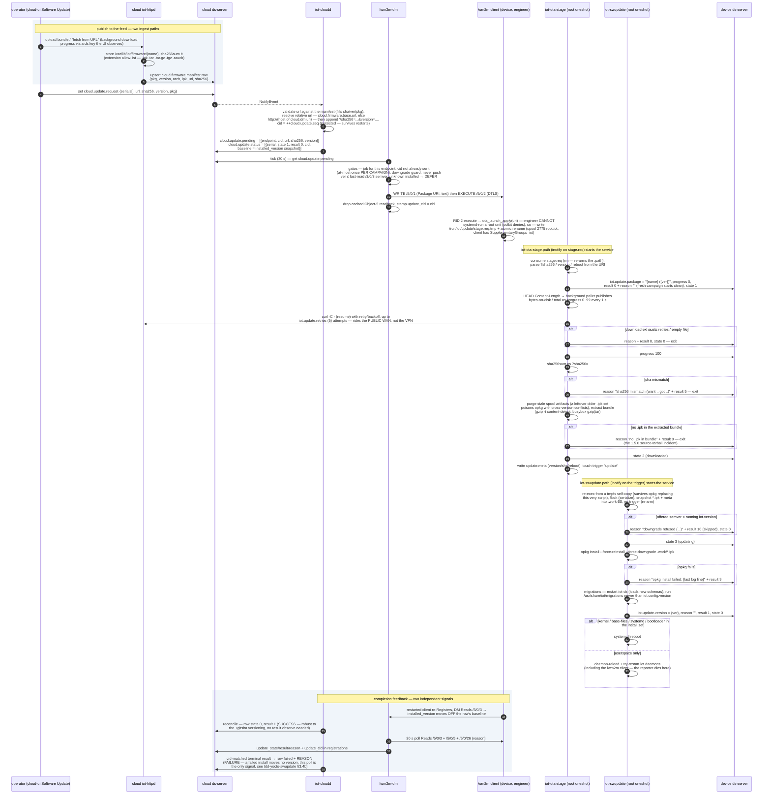

Minute details worth knowing:

- **Three downgrade gates, deliberately redundant:** cloud push gate (semver vs
  last-read `/3/0/3`, unknown → defer — a blind push right after Register once
  wedged opkg on cross-version deps), device `iot-swupdate` gate (result 10
  "skipped"), and opkg's own `--force-downgrade` is only reachable through the
  first two.
- **The campaign id (`cid`)** is a persisted monotonic counter, not a clock:
  re-pushing even the *same* version re-sends (fresh cid), double-pushes in
  the same second stay distinct, and the Object-5 failure readback is
  attributed to exactly the campaign that was pushed (`update_cid` match).
- **Progress is byte-accurate on the device, phase-based on the cloud:** the
  stager's poller publishes real bytes/total to `iot.update.progress`
  (device-ui); the cloud bar maps Object-5 state → 30/65/90 %.
- **The download rides the WAN, not the VPN** — the manifest URL resolves
  against the cloud's *public* base, so a device with a down tunnel still
  updates (and the feed is https:443 — an empty `base.url` once produced a
  dead `http://…:80` URL).
- **Everything in `/run/iot/update` is tmpfs** — a reboot wipes half-staged
  campaigns; the spool's `2775 root:iot` mode is restored by both scripts
  because a root `mkdir` under umask once locked the engineer client out of
  writing the *next* `stage.req` (EACCES → campaign hangs).
- **A/B variant:** a `.raucb` in the spool takes the rauc branch instead of
  opkg — `rauc install` writes the **inactive** bank, reboot activates it, the
  bootloader's boot-attempts counter rolls back unless `iot-ota-confirm`
  health-checks and marks the boot good (`iot.boot.bank/banks/confirmed`,
  shown on the device-ui Software page). Atomic and power-fail-safe, unlike
  the in-place opkg path.
- **`iot.update.request` is the third entry point:** device-ui (or a direct
  Object-5 write) can set a URL locally — same stager path, no cloud campaign
  row. Drag-and-drop upload on the device-ui skips the stager entirely and
  drops the artifact straight into the spool.

---

## 9. Schema summary

### Device ds keys (`modules/vehicle/schemas/vehicle.lua`, `.../cell.lua`)

| Key | Type | Persist | Set by | Consumed as |
|---|---|---|---|---|
| `vehicle.can.iface` / `.bitrate` / `.poll.interval.ms` | string/int | yes | operator | daemon config |
| `vehicle.speed rpm coolant throttle load fuel iat maf` | string | **volatile** | iot-vehicled | Object 33000 rid 0–7 |
| `vehicle.dtc` | string | **yes** | iot-vehicled | Object 33000 rid 8 |
| `vehicle.link` | string | volatile | iot-vehicled | Object 33000 rid 10 |
| `gps.lat lon alt speed` | string | volatile | cellular-client | Object 6 rid 0/1/2/6 |
| `iot.telemetry.send.enable` (+6) | mixed | yes | operator | Send Uploader (gated) |

### LwM2M objects

| Object | Name | RIDs |
|---|---|---|
| **6** | Location | 0 lat, 1 lon, 2 alt, 5 ts, 6 speed |
| **33000** | Vehicle telemetry (private) | 0 speed … 7 maf, 8 dtc, 10 link |

### Cloud

| Where | Name | Shape |
|---|---|---|
| ds key | `cloud.vehicle.telemetry` (volatile) | JSON array of `{endpoint,lat,lon,<signals>,link,dtc}` |
| Mongo | db `iot`, coll `telemetry` | `{ts, endpoints:[{endpoint,lat,lon,<signals>}]}` |

---

## 10. Prerequisites (end-to-end)

**Device**
- `ds-server` running (daemons exit if `connect` fails).
- CAN up: `iot-can0-up.service` (`ip link set can0 up type can bitrate 500000`),
  kernel CAN controller driver (e.g. `mcp251x`) + `can`/`can-raw` modules.
- `iot-vehicled` (`CAP_NET_RAW`, `After=iot-ds iot-can0-up`), and a vehicle/ECU on
  the bus answering PIDs (else `vehicle.link=no-ecu`).
- `cellular-client` with a **GNSS fix** for map position (`gps.lat/lon`).
- `lwm2m` client **registered** to the cloud DM over direct DTLS `:5683` — this is
  what lets `lwm2m-dm` server-Read Objects 6 & 33000. **VPN is not required** for
  telemetry (direct DTLS plane).

**Cloud**
- `lwm2m-dm` (issues the token-tagged Reads → `cloud.vehicle.telemetry`).
- `iot-httpd` (spools telemetry + serves `/api/v1/cloud/telemetry/history` + UI).
- **`telemetry` compose profile** enabled for history + basemap: `mongo`,
  `tileserver`, `iot-telemetry-ingest`, `iot-archiver`. Without it, **live markers
  still work** (they read the volatile ds key); history/track/charts and tiles do
  not.

**For the (incomplete) LwM2M Send v2 path** — not needed for current map/history:
- `iot.telemetry.send.enable=true` + `iot.telemetry.db.path` set.
- Blocked on: client session-I/O glue on HW, cloud Send persist (currently a
  log-only stub), and full RFC 7959 Block-Wise (only partial in the adapter).

---

_See also: `apps/docs/tdd-vehicle-telemetry.md` (design), `apps/docs/lwm2m-design.md`._
