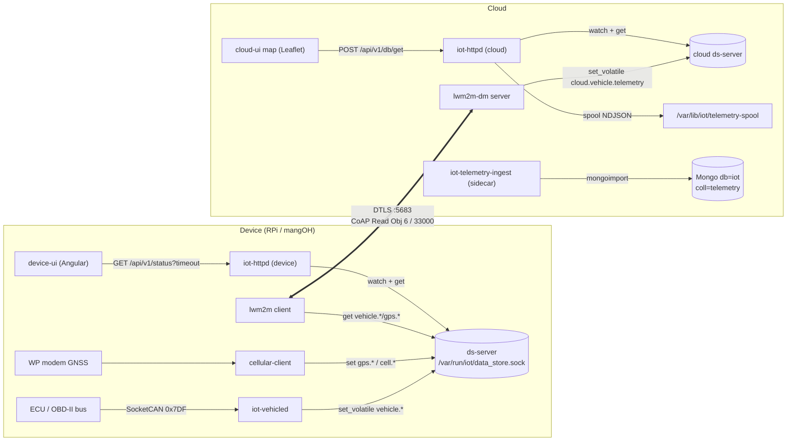
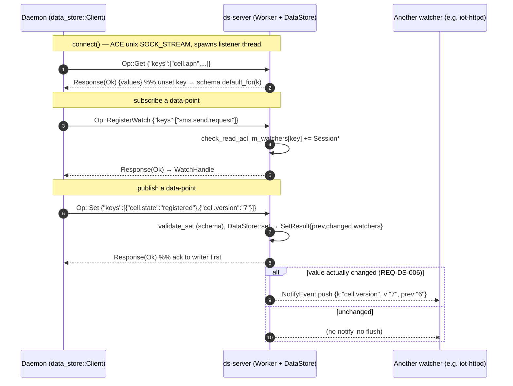
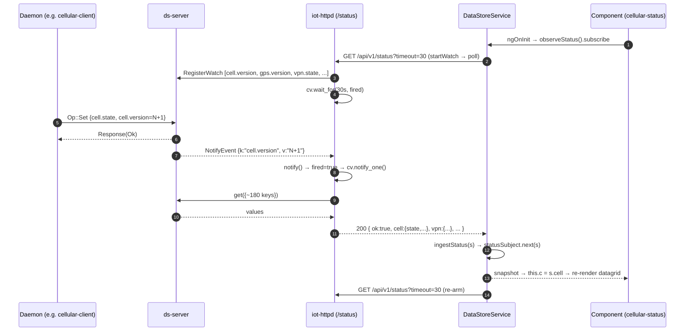
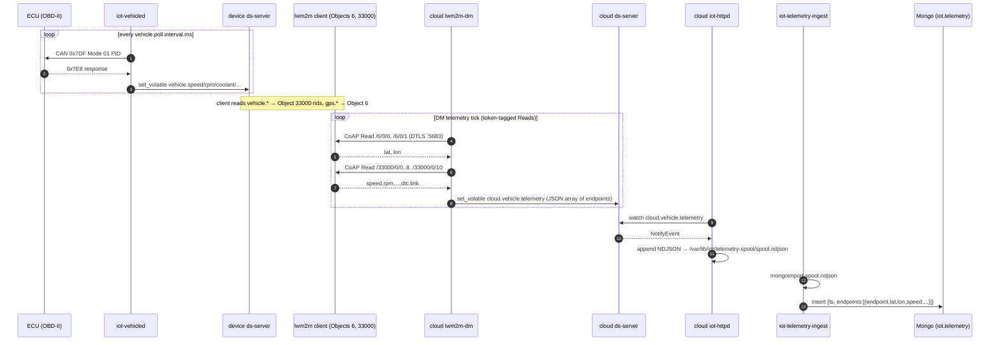
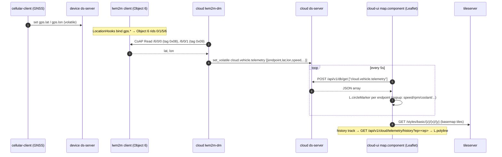

# Data-flow architecture: data-store, UI updates, vehicle telemetry & map

How a daemon publishes/subscribes a data-point, how a change reaches the UI, how
vehicle telemetry is stored, and how a vehicle is tracked on the map — with the
real component, method, and message names from the code.

> **Live vs designed.** The telemetry map + 60-day history ride **`lwm2m-dm`
> server-Reads** of LwM2M Objects 6 & 33000 today. The LwM2M **Send/SenML** path
> is coded + unit-tested but its session-I/O glue and server persist are **gated
> off / stubbed** — it is *not* on the live path. Divergences are called out.

---

## 0. Components at a glance



---

## 1. App ⇄ data-store: publish & subscribe a data-point

The data-store (**ds**) is a typed key/value plane. Daemons talk to `ds-server`
over a unix socket (`/var/run/iot/data_store.sock`) using the **EMP** wire
protocol (`modules/data-store/inc/data_store/proto.hpp`): an 8-byte big-endian
header `{cmdID, type, reqID, size}` + JSON body.

Ops (`proto::Op`): `Set 0x0001`, `Get 0x0002`, `RegisterWatch 0x0003`,
`RemoveWatch 0x0004`, `NotifyEvent 0x0064` (server→client **push**).

Keys are typed by `*.lua` **schema** files loaded from `/etc/iot/ds-schemas/`
(`type`, `access`, `default`, `min`/`max`, `read_acl`/`write_acl`). A `Set` is
validated against the schema (`Status::SchemaRejected` on mismatch). **Persistent**
keys write `m_data` and flush to `/var/lib/iot/data_store.lua`; **volatile** keys
(`set_volatile`) write an in-RAM overlay only — used for fast-changing telemetry —
and are lost on server restart. Both emit identical `NotifyEvent` pushes.



**Concrete example — `cellular-client`** (`modules/wan/cellular/daemon/cellular_client.cpp`):

1. `m_ds.connect(...)` → 2. `load_config_from_ds()` issues `get` for
`cell.apn`/`cell.modem.tty`/… (Admin read keys) → 3.
`watch("sms.send.request", on_send_request, &wh)` → 4. every poll
`publish()` builds `m_state.to_kv()` and `set(...)` the Viewer status keys
(`cell.state/operator/signal.dbm/ip/…`) plus the **bump counter `cell.version`**.
`sms.send.status` progress uses `set_volatile`.

> The **`*.version` bump keys** are the trick that makes the UI cheap: the daemon
> increments `cell.version` only when something actually changed, and that single
> key is what the `/status` long-poll watches.

---

## 2. How an update reaches the UI (long-poll round trip)

`iot-httpd` serves `GET /api/v1/status?timeout=N` (`modules/http-server/src/handler.cpp`).
It registers ds watches on a small set of **bump/edge keys** — `cell.version`,
`gps.version`, `sms.version`, `vpn.state`, `iot.conn.state`,
`services.stats.version`, `log.version`, `iot.update.state`, `cloud.update.status`,
`iot.sensor.version` — then blocks on a condition variable up to `timeout`
seconds. A `NotifyEvent` on any of them wakes it; it then does one bulk `get` of
~180 keys, builds a nested JSON snapshot (`lwm2m/vpn/wifi/wan/cell/gps/sensor/…`),
and returns it — ending the long-poll. On timeout it returns the snapshot anyway.

The Angular `DataStoreService` keeps a permanent long-poll open and republishes
each snapshot to a `BehaviorSubject`; components `observeStatus().subscribe(...)`.



**Config writes** go the other way: the UI calls `ds.write([{key,value}...])` →
`POST /api/v1/db/set` → `ds-server Op::Set`. Example: the Send-SMS box writes
`sms.send.to` + `sms.send.text` + bumps `sms.send.request`, which the daemon's
watch (step 3 above) is waiting on.

---

## 3. Vehicle telemetry: ingest → storage

**Ingest.** `iot-vehicled` (`modules/vehicle/`) opens a raw SocketCAN socket on
`can0`, round-robins Mode 01 PID requests on the functional id `0x7DF`, decodes
ECU replies (`0x7E8..0x7EF`) with the pure `obd_pid` core, and publishes each
signal **volatile** to `vehicle.*`. DTCs (Mode 03, single-frame only) go to the
**persistent** `vehicle.dtc`. GPS position comes separately from `cellular-client`
(`gps.lat/lon`).

**Storage is two-tier, and the live path is server-Reads — not Send:**



### Device-side store-and-forward buffer (the v2 Send path — **gated off**)

The on-device Mongo buffer in the original TDD was **rejected** in favour of a
SQLite outbox, **`DurableSampleBuffer`** (`apps/inc/lwm2m_durable_sample_buffer.hpp`),
which the LwM2M-Send `Uploader` drains. It exists and is unit-tested but is
**off by default** (`iot.telemetry.send.enable=false`) and the **cloud persist for
a Send report is a stub** (`onSendReport` just logs), so nothing is stored via
Send today.

```
outbox( seq  INTEGER PRIMARY KEY AUTOINCREMENT,
        ts   INTEGER,              -- llround(timeUnix * 1000)
        body BLOB,                 -- Sample as compact JSON {t, v:[[name,val]...]}
        sent INTEGER DEFAULT 0 )   -- 0=queued, 1=leased; WAL, synchronous=NORMAL
```

Semantics: `push`→INSERT (+evict over cap); `take(n)`→**lease** oldest n
(`sent=1`, not deleted); `commit()`→DELETE on 2.04 ACK; `requeue()`→un-lease on
timeout; `reap_expired()`→TTL delete. On open, leased rows re-arm to `sent=0` →
**at-least-once** (cloud dedups by `(endpoint, seq)`).

### Cloud collection

Db `iot`, collection **`telemetry`** (`mongo:5.0`, opt-in `telemetry` compose
profile). One document per poll cycle:

```json
{ "ts": 1783726848,
  "endpoints": [
    { "endpoint":"000000006556e041", "lat":12.97,"lon":77.59,
      "speed":42,"rpm":1800,"coolant":88,"throttle":18,"load":34,
      "fuel":61,"iat":31,"maf":12.4,"link":"up","dtc":"" } ] }
```

> **Divergences from the TDD:** the cloud collection is a **plain** collection via
> `mongoimport` — *not* a native time-series with `expireAfterSeconds`; retention
> is a separate `iot-archiver` script (dump → verify → prune). ISO-TP multi-frame
> DTCs (`obd/isotp.cpp`) are **not** implemented (single-frame only). `iot-mqttd`
> has **no** source/unit in-tree and is not on the telemetry path.

---

## 4. How a vehicle is tracked on the map

Position originates from the modem GNSS, is exposed as **LwM2M Object 6
(Location)**, server-Read by `lwm2m-dm`, merged into `cloud.vehicle.telemetry`
alongside the Object-33000 signals, and plotted by the cloud-UI **Leaflet** map.



- **Live markers:** `map.component.ts` long-polls `cloud.vehicle.telemetry` every
  5 s and draws a `L.circleMarker` per endpoint with a fix.
- **History track:** `GET /api/v1/cloud/telemetry/history?ep=<ep>` →
  `L.polyline` (served from `history.json` produced by the ingest sidecar's
  `mongoexport`).
- **Endpoints → Map:** the Endpoints datagrid links to the map via a `?ep=`
  focus param. Note `cloud.endpoints` rows do **not** carry lat/lon (that TDD idea
  was not implemented); position lives only in `cloud.vehicle.telemetry`.

---

## 5. Schema summary

### Device ds keys (`modules/vehicle/schemas/vehicle.lua`, `.../cell.lua`)

| Key | Type | Persist | Set by | Consumed as |
|---|---|---|---|---|
| `vehicle.can.iface` / `.bitrate` / `.poll.interval.ms` | string/int | yes | operator | daemon config |
| `vehicle.speed rpm coolant throttle load fuel iat maf` | string | **volatile** | iot-vehicled | Object 33000 rid 0–7 |
| `vehicle.dtc` | string | **yes** | iot-vehicled | Object 33000 rid 8 |
| `vehicle.link` | string | volatile | iot-vehicled | Object 33000 rid 10 |
| `gps.lat lon alt speed` | string | volatile | cellular-client | Object 6 rid 0/1/2/6 |
| `iot.telemetry.send.enable` (+6) | mixed | yes | operator | Send Uploader (gated) |

### LwM2M objects

| Object | Name | RIDs |
|---|---|---|
| **6** | Location | 0 lat, 1 lon, 2 alt, 5 ts, 6 speed |
| **33000** | Vehicle telemetry (private) | 0 speed … 7 maf, 8 dtc, 10 link |

### Cloud

| Where | Name | Shape |
|---|---|---|
| ds key | `cloud.vehicle.telemetry` (volatile) | JSON array of `{endpoint,lat,lon,<signals>,link,dtc}` |
| Mongo | db `iot`, coll `telemetry` | `{ts, endpoints:[{endpoint,lat,lon,<signals>}]}` |

---

## 6. Prerequisites (end-to-end)

**Device**
- `ds-server` running (daemons exit if `connect` fails).
- CAN up: `iot-can0-up.service` (`ip link set can0 up type can bitrate 500000`),
  kernel CAN controller driver (e.g. `mcp251x`) + `can`/`can-raw` modules.
- `iot-vehicled` (`CAP_NET_RAW`, `After=iot-ds iot-can0-up`), and a vehicle/ECU on
  the bus answering PIDs (else `vehicle.link=no-ecu`).
- `cellular-client` with a **GNSS fix** for map position (`gps.lat/lon`).
- `lwm2m` client **registered** to the cloud DM over direct DTLS `:5683` — this is
  what lets `lwm2m-dm` server-Read Objects 6 & 33000. **VPN is not required** for
  telemetry (direct DTLS plane).

**Cloud**
- `lwm2m-dm` (issues the token-tagged Reads → `cloud.vehicle.telemetry`).
- `iot-httpd` (spools telemetry + serves `/api/v1/cloud/telemetry/history` + UI).
- **`telemetry` compose profile** enabled for history + basemap: `mongo`,
  `tileserver`, `iot-telemetry-ingest`, `iot-archiver`. Without it, **live markers
  still work** (they read the volatile ds key); history/track/charts and tiles do
  not.

**For the (incomplete) LwM2M Send v2 path** — not needed for current map/history:
- `iot.telemetry.send.enable=true` + `iot.telemetry.db.path` set.
- Blocked on: client session-I/O glue on HW, cloud Send persist (currently a
  log-only stub), and full RFC 7959 Block-Wise (only partial in the adapter).

---

_See also: `apps/docs/tdd-vehicle-telemetry.md` (design), `apps/docs/lwm2m-design.md`._
